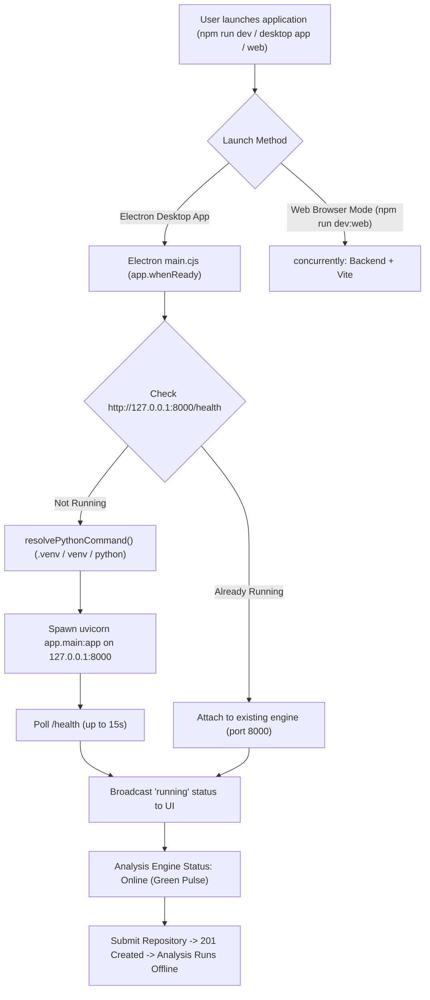

# Resolution Report: Local Analysis Engine Connection Failure & Permanent Fix

## 1. Executive Summary & Root Cause Analysis

### What Caused the "Network Error"?
When opening the **Open Code Repository** modal and attempting to analyze a repository (such as `https://github.com/Ai-Chetan/NexusGrid`), the application displayed a red `(!) Network Error`.

The root cause was that **the Python FastAPI analysis engine (port 8000) was never started**:

1. **Decoupled Development Commands**:
   - The user launched the project using `npm run dev` (as prescribed by standard developer conventions and the project README).
   - In root `package.json`, `"dev"` was defined solely as `npm --prefix frontend run dev`.
   - In `frontend/package.json`, `"dev"` was defined as `concurrently -k -r "vite" "wait-on tcp:5173 && electron ."`.
   - Neither of these scripts spawned or triggered the Python backend (`python -m uvicorn app.main:app --app-dir backend --port 8000`).

2. **Electron Dev-Mode Auto-Start Disabled**:
   - In `frontend/electron/main.cjs`, the Electron process had child process spawning and monitoring logic (`startPythonBackend()`), but its invocation was restricted to:
     ```javascript
     if (app.isPackaged || process.env.AUTO_START_BACKEND === 'true') {
       void startPythonBackend();
     }
     ```
   - In local development mode (`app.isPackaged === false`) and with `AUTO_START_BACKEND` unset, Electron skipped starting the Python engine entirely.

3. **Frontend Connection Refusal**:
   - The frontend Axios API client (`frontend/src/lib/api.ts`) sends requests to `http://localhost:8000/api/repositories`.
   - With nothing listening on port 8000, the operating system immediately refused the TCP connection (`ECONNREFUSED`).
   - Axios surfaced this unhandled connection refusal as an `Error: Network Error`.
   - `RepositoryModal.tsx` caught the error and rendered `err.message` (`Network Error`) directly below the input field.

---

## 2. The Permanent Solution Architecture

To ensure that the analysis engine is **always online and reachable whenever the application is opened**, four coordinated layers of protection were implemented:



### Layer 1: Electron Native Auto-Launch & Health Probing
- **Always-on Engine Management (`frontend/electron/main.cjs`)**:
  - Removed the restrictive `if (app.isPackaged || process.env.AUTO_START_BACKEND === 'true')` check.
  - Electron now automatically calls `startPythonBackend()` on `app.whenReady()`.
  - Smart Health Detection: Before launching, it checks `GET http://127.0.0.1:8000/health`. If the backend was already started by the user or an external process, it attaches without creating duplicates. If port 8000 is inactive, it spawns the Python backend as a managed child process.
  - Python Environment Discovery (`resolvePythonCommand`): Automatically checks for `.venv/Scripts/python.exe`, `venv/Scripts/python.exe`, `backend/.venv/Scripts/python.exe`, `process.env.PYTHON_PATH`, and system `python` / `python3`.
  - Process Monitoring & Auto-Cleanup: Streams backend stdout/stderr to Electron logging channels. Automatically executes a tree-kill (`taskkill /pid ... /T /F` on Windows, `SIGTERM` on POSIX) during `window-all-closed` and `before-quit` to ensure no orphaned processes or port lockups.

### Layer 2: Unified Execution Scripts
- **Root `package.json`**:
  - `"dev"`: Runs the full desktop app with Electron auto-managing the backend.
  - `"dev:web"`: Updated to `concurrently -k -r "npm run backend" "npm --prefix frontend run dev:web"` so that running in browser mode without Electron also starts the backend concurrently.
  - `"backend"`: Bound explicitly to `127.0.0.1` (`python -m uvicorn app.main:app --app-dir backend --port 8000 --host 127.0.0.1`).
  - `"start"`: Aliased to `npm run dev`.

### Layer 3: Backend CORS & Filesystem Robustness
- **CORS Configuration (`backend/app/main.py`)**:
  - Configured `CORSMiddleware` with `allow_origin_regex=r"^https?://(localhost|127\.0\.0\.1)(:\d+)?$"` alongside explicit origins (`http://localhost:5173`, `http://127.0.0.1:5173`, `http://localhost:3000`, `http://localhost:8000`, etc.), preventing any cross-origin rejections across Electron or web ports.
- **Cross-Platform Directory Resolution (`backend/app/core/config.py` & `.env`)**:
  - Added `effective_clone_dir` property. On Windows, if `.env` contains the Linux container path `/app/repos`, the engine automatically safely redirects cloning to the user's home directory (`~/.rie/repos`) to avoid permission errors when writing to `C:\app\repos`.

### Layer 4: Resilient UI Error Messaging
- **Enhanced Error Handling (`RepositoryModal.tsx` & `Landing.tsx`)**:
  - Replaced the generic "Network Error" text with a descriptive, actionable message:
    *"Cannot reach local analysis engine on port 8000. Please wait for the engine to initialize or click restart in the top bar."*

---

## 3. Verification & Validation

| Test / Check | Result | Details |
|---|---|---|
| Python Environment | Passed | Python 3.14.4 with all required packages (FastAPI, uvicorn, GitPython, tree-sitter, etc.) |
| Backend Unit & Integration Tests | 35 / 35 Passed | `pytest backend/tests` completed with 0 errors |
| Frontend TypeScript & Bundle Build | Passed | `tsc -b && vite build` compiled 2563 modules with 0 errors |
| Backend Health Probe | 200 OK | `GET http://127.0.0.1:8000/health` verified SQLite and NetworkX graph healthy |
| Remote Git Connectivity | Verified | Git access to `https://github.com/Ai-Chetan/NexusGrid` verified |

---

## 4. How to Run the Application

You can now start the application with standard commands without ever seeing a network error:

```bash
# Recommended Desktop Launch:
npm run dev

# Or Web-Only Mode (opens browser):
npm run dev:web
```

The local analysis engine will automatically boot, report `Online` in the top navigation bar, and handle repository submissions immediately.
